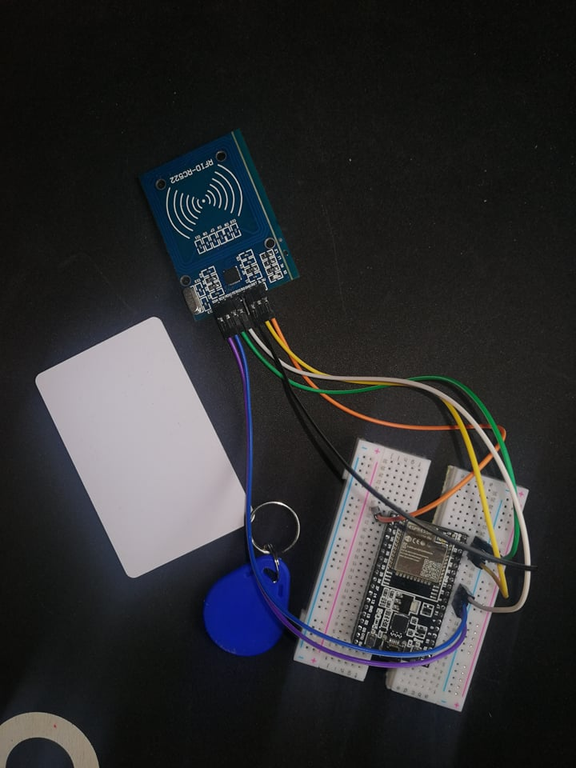
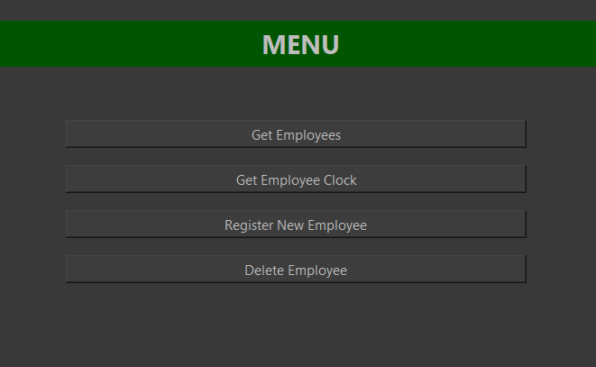
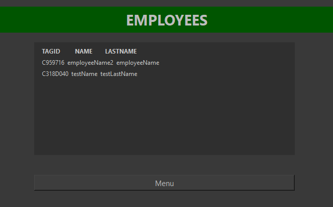
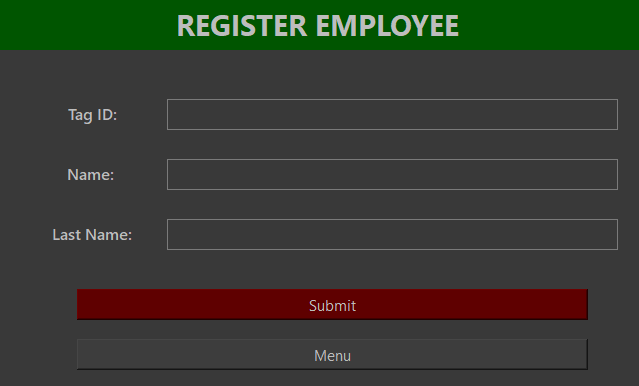
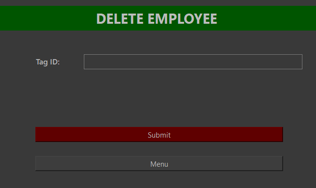
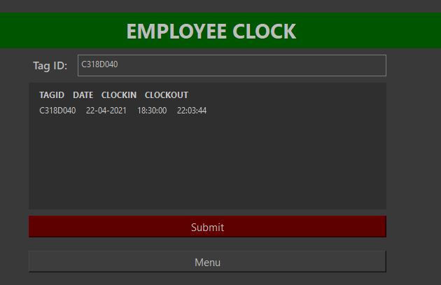
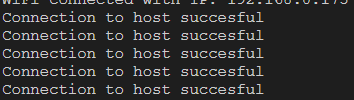
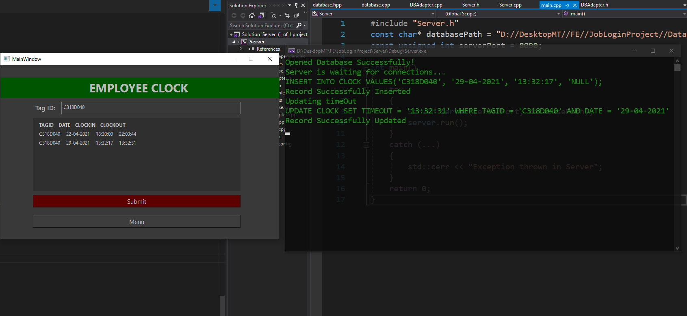

# Employee-Time-Clock
Full System build for tracking Employees work time 
Make sure to update both server and client code, with your Network credentials 

Requirements: 

    Software:
    - SQLite3.c 
    - MFRC522 Library for reading Radio-frequency signals
    - QT
    Hardware:
    -Microcontroller (in my case ESP32)
    -RFID Module
    
The system consists of: 

    - TCP Server(Winsock -> Windows Based)
    - Database Adapter
    - Database
    - two TCP clients (firmware Client and GUI Application)

The Server is responsible for accepting client connections, reading data from clients and passing data
along a database adapter, which either writes or reads from the database.
The Server is capable of hosting multiple TCP connections on unique sockets at once.
Note that the server is not multithreaded, so while it talks to one client, other clients have to wait.

Firmware Client runs on a Microcontroller with an RFID (Radio-frequency identification) Module.
Firmware is responsible for reading a Radio-frequency signal from a tag/card and extracting the tagID information,
it tries to acquire a TCP Connection with the Server, and sends the data along.

GUI Application implements a TCP client and sends read/write requests to the server.
it has 4 main features: 

    - Get all Employees in the database
    - Get work time for each Employee
    - Register a new Employee
    - Delete existing Employee
    
The most interesting being the second feature, using it we can watch the updates on the database made by firmware client.

System Demo 

Employee clock before 

Employee clock after two sensor readings 

GUI client is connected to the server at all times.
Once we move our tag/card closer to the RFID Module, it immediately reads the information, connects to the 
server, and sends the data to the server.
The server updates the database.
On our Employee Clock Window we can see that a new instance appeared.

